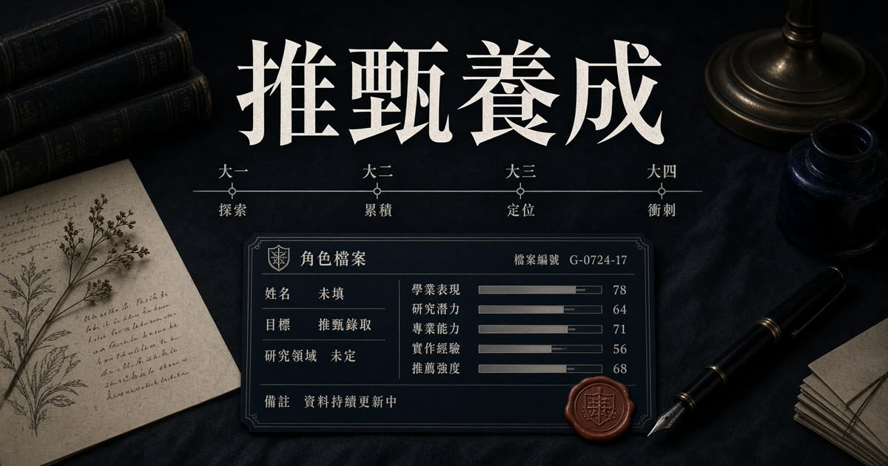

# 推甄養成

**台灣大學生研究所養成 RPG**

從大一走到推甄季。每學期只有三次行動；GPA、論文、實習、教授、英文都在搶同一點體力。推甄結果是遊戲內的適配估算，不是真實錄取預測。

**遊玩：** [https://prairie-sail-lion-sky.grok.me](https://prairie-sail-lion-sky.grok.me)



## 遊戲特色

- 七個學期（大一上到大四上），每學期三個行動
- 十項能力：GPA、英文、程式、研究、專題、論文、證照、人脈、壓力、體力
- 行動前顯示成長區間、壓力與失敗率（投稿接收率、教授收下機率、期中爆炸等）
- 教授／專題／實習會定型，後面的事件、證據卡與面試題跟著變
- 同寢室友走相反傾向，四年後對照適配
- 推甄季組三張書審；過線才進三題口試
- 口試沒有標準答案，差在你有沒有現場
- 結局拆開說明分數怎麼來，並給下一輪可驗證的假設
- 考試入學備案；歷次遊玩存在本機，可比較路線
- 無帳號、無付費；進度寫入瀏覽器 `localStorage`

## 怎麼玩

1. 選學系與開局傾向，入學。
2. 每學期選三步：衝 GPA、做專題、投稿、英文、證照、黑客松、找教授、實習、休息。
3. 專題連做兩次會定成研究型／作品型／資料型；實習與教授也會定路線。
4. 大四上結束後組三張書審。選滿再點第四張可替換。
5. 最接近的所若過線，進面試。三個答案都說得通，沒有經歷會被聽成沒有現場。
6. 結局頁對照室友、考試入學備案，以及這一輪為什麼是這個分數。

室友只比四年能力與實驗室／實習，不含你的書審三張與口試加減分。

## 行動

| 行動 | 定位 |
| --- | --- |
| 衝 GPA | 成績單最笨也最有效；壓力高時可能期中爆炸 |
| 做專題 | 作品完成度；連做會定型 |
| 投稿 | 可能被退；接收了才有論文證據 |
| 準備英文 | 慢變數；夠高才能當英文證明 |
| 考證照 | 不一定過 |
| 參加黑客松 | 程式與人脈，GPA 微降 |
| 找教授 | 門可能不開；收了你之後路線定下來 |
| 實習 | 大二下後開放；第一次會定型 |
| 休息 | 體力與壓力；躺太徹底效益打折 |

## 技術棧

- React 19、TanStack Start / Router、Tailwind CSS v4
- Zustand persist（`localStorage`，有版本遷移）
- 無後端帳號、無資料庫

```text
src/
  lib/game/          規則、事件、推甄估算、存檔
  components/game/   標題、角色、學期、書審、面試、結局
  routes/            頁面入口
public/
  og.jpg             分享圖
```

## 本機執行

需要 [Node.js 22](https://nodejs.org/)。

```bash
git clone https://github.com/richie7p/prairie-sail-lion-sky.git
cd prairie-sail-lion-sky
npm install
npm run dev
```

瀏覽器開啟提示的本機網址即可遊玩。

```bash
npm run typecheck
npm run build
```

本專案不需 API Key、資料庫或登入。

## 聲明

校所適配、面試加減分與考試入學備案都是遊戲內估算，用來玩養成策略，不是錄取預測。

## 授權

未附加授權條款。私人倉庫。若要轉用，請先與倉庫擁有者確認。
