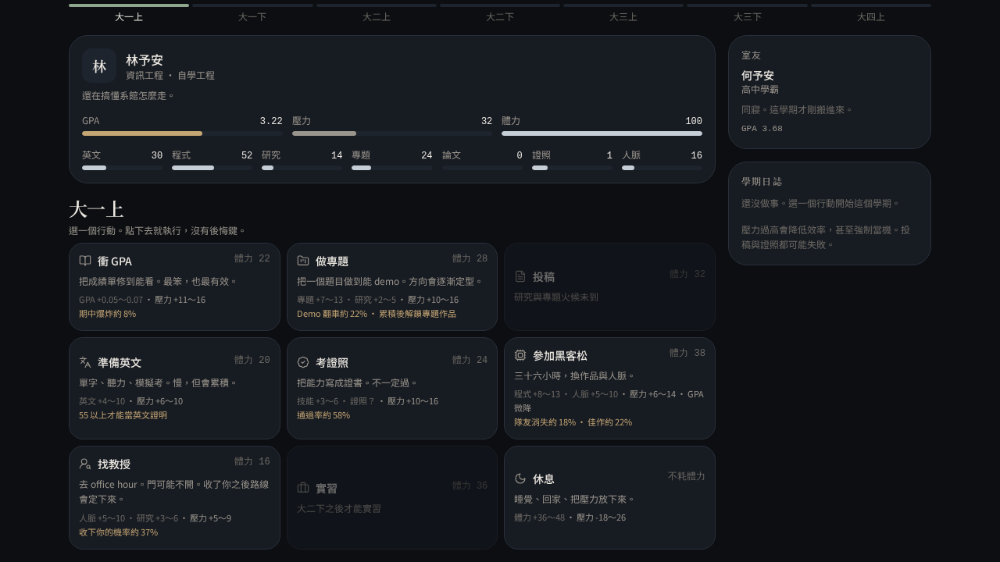
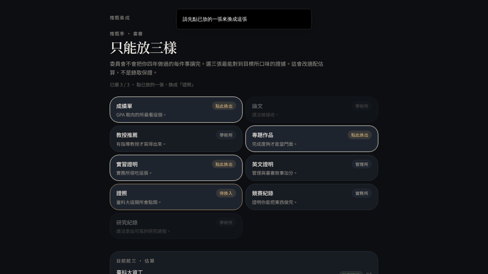
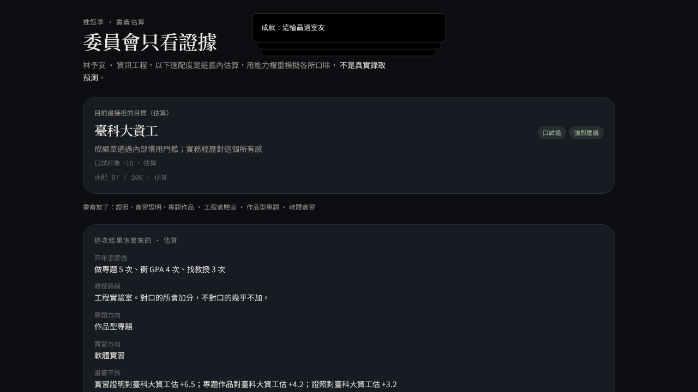

# 推甄養成

台灣大學生研究所養成 RPG。從大一走到推甄季。

**遊玩：** [https://prairie-sail-lion-sky.grok.me](https://prairie-sail-lion-sky.grok.me)

[](https://prairie-sail-lion-sky.grok.me)

每學期只有三次行動。GPA、論文、實習、教授、英文都在搶同一點體力。推甄結果是遊戲內的適配估算，不是真實錄取預測。

無帳號、無付費。進度寫在瀏覽器 `localStorage`。

---

## 畫面

| 學期行動 | 書審三張 | 結局拆解 |
| --- | --- | --- |
| [](https://prairie-sail-lion-sky.grok.me) | [](https://prairie-sail-lion-sky.grok.me) | [](https://prairie-sail-lion-sky.grok.me) |

- 行動前會看到成長方向、壓力與失敗率，不是只看體力。
- 書審選滿三張後，再點第四張可替換。
- 結局會寫這一輪分數怎麼來，以及下一輪可以驗證的假設。

## 這是什麼

策略養成，不是考試模擬器。你扮演一名台灣大學生，七個學期（大一上到大四上）各走三步，然後進入推甄季：組書審、過線才口試、對照室友、看考試入學備案。

同一套能力，走教授、專題、實習會定成不同路線，後面的事件、證據卡與面試題跟著變。重玩是為了驗證「如果這次先找教授會怎樣」。

## 特色

- 十項能力：GPA、英文、程式、研究、專題、論文、證照、人脈、壓力、體力
- 教授／專題／實習定型後，事件、證據與口試題分歧
- 同寢室友走相反傾向，四年後對照適配（不含你的書審與口試加減分）
- 推甄季組三張書審；過線才進三題口試
- 口試三個答案都說得通，差在你有沒有現場
- 結局拆開說明分數來源，並給下一輪假設
- 考試入學備案；歷次遊玩最多留 8 輪，可比較路線

## 怎麼玩

1. 選學系（資工／資管／電機／應數）與開局傾向，入學。
2. 每學期選三步。投稿、找教授、考證照可能失敗；壓力高時衝 GPA 可能期中爆炸。
3. 專題連做兩次會定成研究型／作品型／資料型；實習第一次、教授收下你之後也會定路線。
4. 大四上結束後組三張書審。選滿再點第四張可替換。
5. 最接近的所若過線，進面試。沒有對應經歷的答案會被聽成沒有現場。
6. 結局頁對照室友、考試入學備案，以及這一輪為什麼是這個分數。

## 能力

| 能力 | 說明 |
| --- | --- |
| GPA | 4.3 制。成績單最硬的一欄 |
| 英文 | 慢變數；夠高才能當英文證明 |
| 程式 | 黑客松、實習、作品型專題 |
| 研究 | 實驗室、論文、學術型教授 |
| 專題 | 作品完成度；連做會定型 |
| 論文 | 投稿接收了才算 |
| 證照 | 考過才進書審 |
| 人脈 | 找教授、實習、黑客松 |
| 壓力 | 太高會咬行動成功率 |
| 體力 | 每學期會回一些；透支會鎖行動 |

## 行動

| 行動 | 定位 |
| --- | --- |
| 衝 GPA | 成績單最笨也最有效；壓力高時可能期中爆炸 |
| 做專題 | 作品完成度；連做兩次定型 |
| 投稿 | 可能被退；接收了才有論文證據 |
| 準備英文 | 慢變數；夠高才能當英文證明 |
| 考證照 | 不一定過 |
| 參加黑客松 | 程式與人脈，GPA 微降 |
| 找教授 | 門可能不開；收了你之後路線定下來 |
| 實習 | 大二下後開放；第一次會定型 |
| 休息 | 體力與壓力；躺太徹底效益打折 |

## 路線

| 系統 | 定型時機 | 可能方向 |
| --- | --- | --- |
| 教授 | 收下你之後 | 學術／實作／管理 |
| 專題 | 第二次做專題 | 研究型／作品型／資料型 |
| 實習 | 第一次實習 | 軟體／實驗室／專案 |

路線會解鎖不同事件、證據卡（含研究紀錄）與口試題。書審與口試加分只算在你身上；室友只比四年能力與實驗室／實習。

## 技術棧

- React 19、TanStack Start / Router、Tailwind CSS v4
- Zustand persist（`localStorage`，存檔有版本遷移）
- 無後端帳號、無資料庫

```text
src/lib/game/          規則、事件、推甄估算、存檔
src/components/game/   標題、角色、學期、書審、面試、結局
src/routes/            頁面入口
public/og.jpg          分享圖
```

## 本機執行

需要 [Node.js 22](https://nodejs.org/)。此倉庫為私人倉庫，需有權限才能 clone。

```bash
git clone https://github.com/richie7p/prairie-sail-lion-sky.git
cd prairie-sail-lion-sky
npm install
npm run dev
```

瀏覽器開啟提示的本機網址即可遊玩。不需 API Key、資料庫或登入。

```bash
npm run typecheck
npm run build
```

## 存檔

進度存在瀏覽器 `localStorage`（鍵名 `tuijian-rpg-v1`）。換裝置或清站台資料會沒有進度。歷次遊玩最多保留 8 輪。舊存檔會自動遷移。

## 聲明

校所適配、面試加減分與考試入學備案都是**遊戲內估算**，用來玩養成策略，不是錄取預測，也不是任何校所的官方標準。

## 授權

未附加授權條款。私人倉庫。若要轉用，請先與倉庫擁有者確認。
